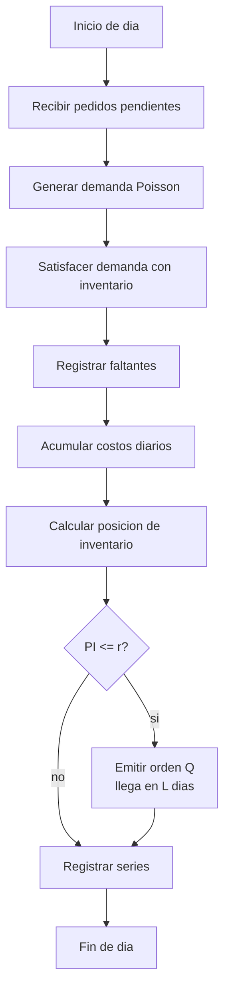
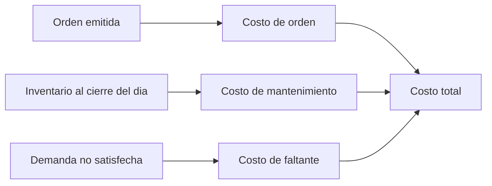

# Guia paso a paso AnyLogic - Modelo de inventario (Q, r)

## Objetivo

Este documento explica como construir en AnyLogic Personal Learning Edition
8.9.x el modelo de inventario del TP, usando la politica de revision continua
`(Q, r)` ya implementada en Python.

La guia busca que el modelo sea facil de modificar en clase y que produzca
metricas comparables con:

- simulador Python del proyecto;
- resultados teoricos o esperados del marco de inventario, cuando se definan;
- implementacion en AnyLogic.

## Version y alcance

Fuentes oficiales consultadas el 2026-06-28:

- AnyLogic downloads: https://www.anylogic.com/downloads/
- AnyLogic release notes: https://anylogic.help/anylogic/introduction/release-notes.html
- Probability distributions: https://anylogic.help/anylogic/stochastic/probability-distributions.html
- Events: https://anylogic.help/anylogic/statecharts/events.html
- Data Set: https://anylogic.help/anylogic/analysis/data-set.html
- Time Plot: https://anylogic.help/anylogic/analysis/time-plot.html
- Parameter Variation: https://anylogic.help/anylogic/experiments/parameter-variation.html
- Controls vinculados a parametros: https://anylogic.help/anylogic/controls/linking.html

Nota de version: la pagina de descargas publica indica `8.9.8` como version
descargable y las release notes oficiales ya listan `8.9.9` del 2026-06-18.
Los elementos usados aqui (`Event`, `DataSet`, `Time Plot`, distribucion
`poisson`, controles y `Parameter Variation`) son de AnyLogic 8.9.x.

## Contexto del proyecto

Parametros vigentes en `config/default_parameters.json`:

| Parametro | Valor |
| --- | ---: |
| Unidad de tiempo | dias |
| Politica | revision continua `(Q, r)` |
| Horizonte | 365 dias |
| Replicas | 10 |
| Semilla base | 20260626 |
| Demanda | Poisson |
| Demanda media diaria | 20 unidades/dia |
| Inventario inicial | 120 unidades |
| Tiempo de entrega | 3 dias |
| Costo fijo de orden | 120 |
| Costo de mantenimiento | 0.35 por unidad por dia |
| Costo de faltante | 8 por unidad faltante |

Politicas a comparar:

| Politica | Q | r | Interpretacion |
| --- | ---: | ---: | --- |
| `bajo_inventario` | 80 | 45 | menor inventario, mayor riesgo de faltantes |
| `balanceada` | 120 | 70 | punto medio entre mantenimiento y faltantes |
| `alto_servicio` | 160 | 95 | mayor servicio, mayor mantenimiento |

Decision de modelado ya adoptada:

- Los faltantes son ventas perdidas.
- La demanda no satisfecha genera costo y no queda pendiente para dias futuros.
- La posicion de inventario es inventario disponible mas unidades en pedido.

## Vista general del modelo

El modelo puede implementarse como logica discreta diaria dentro de `Main`, sin
necesidad de la Process Modeling Library.



## Paso 1 - Crear el modelo

1. Abrir AnyLogic PLE.
2. Crear un modelo nuevo: `File > New > Model`.
3. Nombre sugerido: `TP3_Inventario_AnyLogic`.
4. Unidad de tiempo: `days`.
5. Dejar el agente principal como `Main`.
6. Guardar el modelo en una carpeta del TP, por ejemplo
   `data/anylogic/inventory/`.

## Paso 2 - Crear parametros en Main

Agregar estos `Parameter`:

| Nombre | Tipo | Valor inicial |
| --- | --- | ---: |
| `horizonteDias` | `int` | `365` |
| `demandaMediaDiaria` | `double` | `20` |
| `inventarioInicial` | `int` | `120` |
| `tiempoEntregaDias` | `int` | `3` |
| `costoFijoOrden` | `double` | `120` |
| `costoMantenimientoUnidadDia` | `double` | `0.35` |
| `costoFaltanteUnidad` | `double` | `8` |
| `Q` | `int` | `120` |
| `r` | `int` | `70` |
| `politicaNombre` | `String` | `"balanceada"` |
| `semillaBase` | `int` | `20260626` |

Para cambiar de politica en clase, basta modificar `Q`, `r` y
`politicaNombre`.

## Paso 3 - Crear variables de estado

Agregar estas variables en `Main`:

```java
int diaActual = 1;
int inventarioDisponible = 0;
int unidadesEnPedido = 0;

int demandaTotal = 0;
int demandaSatisfecha = 0;
int unidadesFaltantes = 0;
int ordenesEmitidas = 0;

double inventarioAcumulado = 0;
double costoOrden = 0;
double costoMantenimiento = 0;
double costoFaltante = 0;

java.util.ArrayList<Integer> diasLlegadaPedidos = new java.util.ArrayList<Integer>();
java.util.ArrayList<Integer> cantidadesPedidos = new java.util.ArrayList<Integer>();
```

Las dos listas guardan pedidos pendientes: una lista con el dia de llegada y
otra con la cantidad correspondiente.

## Paso 4 - Inicializar el modelo

Agregar la funcion `reiniciarModelo()`:

```java
void reiniciarModelo() {
    diaActual = 1;
    inventarioDisponible = inventarioInicial;
    unidadesEnPedido = 0;

    demandaTotal = 0;
    demandaSatisfecha = 0;
    unidadesFaltantes = 0;
    ordenesEmitidas = 0;

    inventarioAcumulado = 0;
    costoOrden = 0;
    costoMantenimiento = 0;
    costoFaltante = 0;

    diasLlegadaPedidos.clear();
    cantidadesPedidos.clear();
}
```

En el `Startup` de `Main` o en el inicio del experimento, llamar:

```java
reiniciarModelo();
```

## Paso 5 - Recibir pedidos pendientes

Agregar la funcion `recibirPedidosPendientes()`:

```java
int recibirPedidosPendientes() {
    int recibido = 0;

    for (int i = diasLlegadaPedidos.size() - 1; i >= 0; i--) {
        if (diasLlegadaPedidos.get(i) <= diaActual) {
            int cantidad = cantidadesPedidos.get(i);
            recibido += cantidad;
            inventarioDisponible += cantidad;
            unidadesEnPedido -= cantidad;

            diasLlegadaPedidos.remove(i);
            cantidadesPedidos.remove(i);
        }
    }

    return recibido;
}
```

Este paso replica la logica Python: al inicio de cada dia entran las ordenes cuyo
dia de llegada ya se cumplio.

## Paso 6 - Emitir una orden

Agregar la funcion `emitirOrden()`:

```java
void emitirOrden() {
    ordenesEmitidas++;
    costoOrden += costoFijoOrden;

    unidadesEnPedido += Q;
    diasLlegadaPedidos.add(diaActual + tiempoEntregaDias);
    cantidadesPedidos.add(Q);
}
```

Si `tiempoEntregaDias = 3` y se emite una orden el dia 10, se recibe al inicio
del dia 13.

## Paso 7 - Calcular metricas finales

Agregar estas funciones:

```java
double costoTotal() {
    return costoOrden + costoMantenimiento + costoFaltante;
}

double nivelServicio() {
    return demandaTotal > 0 ? (double) demandaSatisfecha / demandaTotal : 1;
}

double inventarioPromedio() {
    return horizonteDias > 0 ? inventarioAcumulado / horizonteDias : 0;
}

int posicionInventario() {
    return inventarioDisponible + unidadesEnPedido;
}
```

El costo total coincide con el marco teorico del informe:

```text
C = costo de orden + costo de mantenimiento + costo de faltante
```

## Paso 8 - Crear el evento diario

Arrastrar un `Event` desde la paleta `Agent` al diagrama de `Main`.

Configurar:

| Propiedad | Valor |
| --- | --- |
| Nombre | `eventoDia` |
| Trigger type | `Timeout` |
| Mode | `Cyclic` |
| First occurrence time | `1` |
| Recurrence time | `1` |

La ayuda oficial indica que un evento ciclico permite ejecutar acciones
periodicas. En este modelo, una ocurrencia representa un dia.

En `Action`, llamar:

```java
simularDia();
```

## Paso 9 - Programar la logica de un dia

Agregar la funcion `simularDia()`:

```java
void simularDia() {
    if (diaActual > horizonteDias) {
        return;
    }

    int pedidosRecibidos = recibirPedidosPendientes();

    int demandaDiaria = poisson(demandaMediaDiaria);
    int satisfechaDia = Math.min(inventarioDisponible, demandaDiaria);
    int faltantesDia = demandaDiaria - satisfechaDia;

    inventarioDisponible -= satisfechaDia;

    demandaTotal += demandaDiaria;
    demandaSatisfecha += satisfechaDia;
    unidadesFaltantes += faltantesDia;

    double costoMantenimientoDia =
        inventarioDisponible * costoMantenimientoUnidadDia;
    double costoFaltanteDia =
        faltantesDia * costoFaltanteUnidad;

    costoMantenimiento += costoMantenimientoDia;
    costoFaltante += costoFaltanteDia;
    inventarioAcumulado += inventarioDisponible;

    int posicionAntesOrden = posicionInventario();
    boolean ordenEmitida = false;

    if (posicionAntesOrden <= r) {
        emitirOrden();
        ordenEmitida = true;
    }

    registrarSeries(
        pedidosRecibidos,
        demandaDiaria,
        satisfechaDia,
        faltantesDia,
        ordenEmitida,
        costoMantenimientoDia,
        costoFaltanteDia
    );

    diaActual++;
}
```

La funcion `poisson(demandaMediaDiaria)` usa la distribucion de probabilidad de
AnyLogic para generar demanda diaria discreta.

## Paso 10 - Crear datasets para graficas

Desde la paleta `Analysis`, agregar estos `Data Set` en `Main`:

| Nombre | Eje X | Valor Y |
| --- | --- | --- |
| `dsInventario` | tiempo | inventario disponible |
| `dsDemanda` | tiempo | demanda diaria |
| `dsFaltantes` | tiempo | unidades faltantes |
| `dsCostoOrden` | tiempo | costo de orden acumulado |
| `dsCostoMantenimiento` | tiempo | costo de mantenimiento acumulado |
| `dsCostoFaltante` | tiempo | costo de faltante acumulado |
| `dsCostoTotal` | tiempo | costo total acumulado |

Configurar cada dataset como manual, porque se actualizara desde
`registrarSeries()`.

Agregar la funcion:

```java
void registrarSeries(
    int pedidosRecibidos,
    int demandaDiaria,
    int satisfechaDia,
    int faltantesDia,
    boolean ordenEmitida,
    double costoMantenimientoDia,
    double costoFaltanteDia
) {
    dsInventario.add(diaActual, inventarioDisponible);
    dsDemanda.add(diaActual, demandaDiaria);
    dsFaltantes.add(diaActual, faltantesDia);
    dsCostoOrden.add(diaActual, costoOrden);
    dsCostoMantenimiento.add(diaActual, costoMantenimiento);
    dsCostoFaltante.add(diaActual, costoFaltante);
    dsCostoTotal.add(diaActual, costoTotal());
}
```

La ayuda oficial indica que `Data Set` permite almacenar datos `(X,Y)` y que un
`Time Plot` puede visualizar la historia de variables o datasets.

## Paso 11 - Crear graficos

Agregar `Time Plot` desde `Analysis`:

1. `graficoInventario`:
   - serie: `dsInventario`;
   - titulo sugerido: `Inventario disponible`.
2. `graficoDemandaFaltantes`:
   - series: `dsDemanda`, `dsFaltantes`;
   - titulo sugerido: `Demanda y faltantes`.
3. `graficoCostos`:
   - series: `dsCostoOrden`, `dsCostoMantenimiento`, `dsCostoFaltante`,
     `dsCostoTotal`;
   - titulo sugerido: `Costos acumulados`.

Diagrama de relacion entre costos:



## Paso 12 - Mostrar resultados finales

Agregar elementos `Text` u `Output` para mostrar:

- `demandaTotal`;
- `demandaSatisfecha`;
- `unidadesFaltantes`;
- `ordenesEmitidas`;
- `inventarioPromedio()`;
- `costoOrden`;
- `costoMantenimiento`;
- `costoFaltante`;
- `costoTotal()`;
- `nivelServicio()`.

Estos valores corresponden a las columnas principales de:

```text
results/inventory/experiments/inventario_corridas.csv
```

## Paso 13 - Agregar controles editables para clase

Para cumplir el requerimiento de modificar parametros iniciales:

1. Agregar `Edit Box` para:
   - `demandaMediaDiaria`;
   - `inventarioInicial`;
   - `tiempoEntregaDias`;
   - `Q`;
   - `r`;
   - costos.
2. Agregar `Radio buttons` o `Combo box` para elegir politica:
   - `bajo_inventario`;
   - `balanceada`;
   - `alto_servicio`.
3. Al cambiar politica, asignar:

```java
if (politicaNombre.equals("bajo_inventario")) {
    Q = 80;
    r = 45;
} else if (politicaNombre.equals("balanceada")) {
    Q = 120;
    r = 70;
} else if (politicaNombre.equals("alto_servicio")) {
    Q = 160;
    r = 95;
}
```

Los controles con estado o contenido pueden vincularse a parametros y variables
en AnyLogic, segun la ayuda oficial.

## Paso 14 - Configurar el experimento

En `Simulation`:

1. `Stop time`: `horizonteDias`.
2. Unidad: `days`.
3. Usar semilla fija para reproducibilidad.
4. Al inicio de cada corrida, llamar `reiniciarModelo()`.

Para comparar las tres politicas y 10 replicas:

```text
3 politicas * 10 replicas = 30 corridas
```

Usar `Parameter Variation` cuando sea posible. AnyLogic PLE incluye
experimentos de simulacion y variacion de parametros segun la tabla oficial de
ediciones.

Matriz sugerida:

| Politica | Q | r |
| --- | ---: | ---: |
| `bajo_inventario` | 80 | 45 |
| `balanceada` | 120 | 70 |
| `alto_servicio` | 160 | 95 |

Semillas sugeridas, compatibles con la convencion Python:

```java
semilla = semillaBase + indicePolitica * 1000 + replica;
```

## Paso 15 - Exportar o registrar resultados

Para cada corrida, registrar:

| Columna | Descripcion |
| --- | --- |
| `politica` | nombre visible de la politica |
| `replica` | 0 a 9 |
| `semilla` | semilla usada |
| `Q` | cantidad fija ordenada |
| `r` | punto de reorden |
| `demanda_total` | demanda acumulada |
| `demanda_satisfecha` | unidades atendidas |
| `unidades_faltantes` | demanda perdida |
| `ordenes_emitidas` | cantidad de ordenes |
| `inventario_promedio` | promedio diario |
| `costo_orden` | costo fijo acumulado |
| `costo_mantenimiento` | costo acumulado de stock |
| `costo_faltante` | costo acumulado de faltantes |
| `costo_total` | suma de costos |
| `nivel_servicio` | demanda satisfecha / demanda total |

Guardar exportaciones o planillas en:

```text
data/anylogic/inventory/
```

## Paso 16 - Comparar contra Python

El resumen Python vigente esta en:

```text
results/inventory/experiments/inventario_resumen.csv
```

Resultados promedio actuales:

| Politica | Costo total promedio | Nivel de servicio promedio | Faltantes promedio |
| --- | ---: | ---: | ---: |
| `bajo_inventario` | 17998.25 | 93.37% | 485.80 |
| `balanceada` | 16304.39 | 99.96% | 2.70 |
| `alto_servicio` | 20235.96 | 100.00% | 0.00 |

La politica recomendada por menor costo total promedio es `balanceada`. La guia
AnyLogic debe permitir verificar si se conserva la misma conclusion.

## Checklist de validacion

- La unidad de tiempo del modelo es dias.
- El evento diario corre una vez por dia.
- La demanda diaria usa `poisson(demandaMediaDiaria)`.
- Al inicio del dia se reciben pedidos pendientes.
- Los faltantes son ventas perdidas, no pedidos atrasados.
- La posicion de inventario es `inventarioDisponible + unidadesEnPedido`.
- Se emite una orden si `posicionInventario <= r`.
- La orden llega luego de `tiempoEntregaDias`.
- El costo de mantenimiento se calcula con inventario al cierre del dia.
- El costo total suma orden, mantenimiento y faltante.
- Se ejecutan 10 replicas por politica.
- Los graficos muestran inventario, demanda, faltantes y costos acumulados.
- Los resultados finales se comparan con `inventario_resumen.csv`.

## Relacion con figuras del proyecto

Las figuras Python actuales sirven como referencia visual:

- `figures/inventory/inventario_disponible.svg`
- `figures/inventory/demanda_diaria.svg`
- `figures/inventory/costos_acumulados.svg`
- `figures/inventory/costo_total_por_politica.svg`
- `figures/inventory/nivel_servicio_por_politica.svg`

