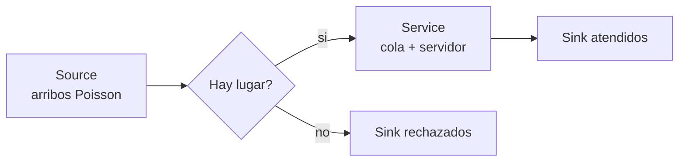
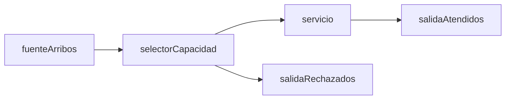

# Guia paso a paso AnyLogic - Modelo M/M/1

## Objetivo

Este documento explica como construir en AnyLogic Personal Learning Edition
8.9.x el modelo `M/M/1` del TP, respetando los parametros, metricas y
criterios teoricos ya usados en Python.

La guia esta pensada para armar un modelo didactico, editable en clase, y luego
comparar tres fuentes:

- formulas teoricas, cuando existe regimen estacionario;
- simulador Python del proyecto;
- implementacion en AnyLogic.

## Version y alcance

Fuentes oficiales consultadas el 2026-06-28:

- AnyLogic downloads: https://www.anylogic.com/downloads/
- AnyLogic release notes: https://anylogic.help/anylogic/introduction/release-notes.html
- Source: https://anylogic.help/library-reference-guides/process-modeling-library/source.html
- Service: https://anylogic.help/library-reference-guides/process-modeling-library/service.html
- Queue: https://anylogic.help/library-reference-guides/process-modeling-library/queue.html
- Events: https://anylogic.help/anylogic/statecharts/events.html
- Data Set: https://anylogic.help/anylogic/analysis/data-set.html
- Time Plot: https://anylogic.help/anylogic/analysis/time-plot.html
- Parameter Variation: https://anylogic.help/anylogic/experiments/parameter-variation.html
- Controls vinculados a parametros: https://anylogic.help/anylogic/controls/linking.html

Nota de version: la pagina de descargas publica indica `8.9.8` como version
descargable y las release notes oficiales ya listan `8.9.9` del 2026-06-18.
Los bloques usados en esta guia (`Source`, `Service`, `Sink`, `Event`,
`DataSet`, `Time Plot`, `Parameter Variation`) son de AnyLogic 8.9.x, por lo
que los pasos sirven aunque la instalacion muestre una de esas versiones.

## Contexto del proyecto

Parametros vigentes en `config/default_parameters.json`:

| Parametro | Valor |
| --- | ---: |
| Unidad de tiempo | horas |
| Tasa de servicio `mu` | 10 clientes/hora |
| Factores de arribo | 0.25, 0.50, 0.75, 1.00, 1.25 |
| Tasas de arribo `lambda` | 2.5, 5.0, 7.5, 10.0, 12.5 clientes/hora |
| Capacidades de cola `B` | infinita, 0, 2, 5, 10, 50 |
| Horizonte | 10000 horas |
| Replicas | 10 por experimento |
| Semilla base | 20260626 |

Convencion importante del TP:

- `B` es la capacidad de cola, no la capacidad total del sistema.
- Si la cola tiene capacidad `B`, entonces la capacidad total es `K = B + 1`.
- Para cola infinita `M/M/1`, solo existe regimen estacionario si `rho < 1`.
- Para cola finita `M/M/1/K`, todos los valores pedidos de `rho` tienen
  regimen estacionario porque los arribos excedentes se rechazan.

## Vista general del modelo

El flujo recomendado usa `Service` con cola interna y una decision previa para
mandar a rechazo a los clientes que no pueden entrar.



La decision `Hay lugar?` se implementa con un bloque `SelectOutput` de la
Process Modeling Library. La condicion acepta clientes si la cola es infinita,
si el servidor esta libre, o si hay lugar en la cola.

```java
capacidadCola < 0 || servicio.delaySize() == 0 || servicio.queueSize() < capacidadCola
```

En esta guia se usa `capacidadCola = -1` para representar cola infinita. En los
CSV del proyecto, esa misma idea aparece como `capacidad_cola = infinita`.

## Paso 1 - Crear el modelo

1. Abrir AnyLogic PLE.
2. Crear un modelo nuevo: `File > New > Model`.
3. Nombre sugerido: `TP3_MM1_AnyLogic`.
4. En el asistente, elegir unidad de tiempo: `hours`.
5. Dejar el agente principal como `Main`.
6. Guardar el modelo dentro de una carpeta local del TP, por ejemplo
   `data/anylogic/mm1/`.

## Paso 2 - Crear el tipo de agente Cliente

1. En el panel `Projects`, clic derecho sobre el modelo.
2. Elegir `New > Agent Type`.
3. Nombre: `Cliente`.
4. En `Cliente`, agregar estos atributos:

| Nombre | Tipo | Valor inicial | Uso |
| --- | --- | ---: | --- |
| `tLlegada` | `double` | `0` | instante de llegada al sistema |
| `tInicioServicio` | `double` | `0` | instante en que empieza el servicio |

Estos tiempos permiten calcular `W` y `Wq` igual que en Python.

## Paso 3 - Declarar parametros en Main

En `Main`, agregar los siguientes `Parameter`.

| Nombre | Tipo | Valor inicial |
| --- | --- | ---: |
| `tasaServicio` | `double` | `10` |
| `factorArribo` | `double` | `0.75` |
| `capacidadCola` | `int` | `-1` |
| `tiempoSimulacion` | `double` | `10000` |
| `semillaBase` | `int` | `20260626` |

Agregar tambien esta funcion auxiliar:

```java
double tasaArribo() {
    return factorArribo * tasaServicio;
}
```

Y otra funcion para mostrar el factor de carga:

```java
double rho() {
    return tasaArribo() / tasaServicio;
}
```

## Paso 4 - Declarar variables de medicion

En `Main`, agregar estas variables:

```java
int clientesGenerados = 0;
int clientesAceptados = 0;
int clientesRechazados = 0;
int clientesAtendidos = 0;

double ultimoTiempo = 0;
double areaClientesSistema = 0;
double areaClientesCola = 0;
double tiempoOcupadoServidor = 0;

double sumaTiempoSistema = 0;
double sumaTiempoCola = 0;

double[] tiempoPorLongitudCola = new double[101];
```

`tiempoPorLongitudCola` guarda cuanto tiempo estuvo la cola con longitud `0`,
`1`, `2`, etc. Si se quiere reportar solo hasta `n = 20`, alcanza con leer las
primeras 21 posiciones.

Agregar esta funcion en `Main`:

```java
void actualizarAreas() {
    double dt = time() - ultimoTiempo;
    if (dt <= 0) {
        ultimoTiempo = time();
        return;
    }

    int enCola = servicio.queueSize();
    int enServicio = servicio.delaySize() > 0 ? 1 : 0;
    int enSistema = enCola + enServicio;

    areaClientesCola += enCola * dt;
    areaClientesSistema += enSistema * dt;
    tiempoOcupadoServidor += enServicio * dt;

    int indiceCola = Math.min(enCola, tiempoPorLongitudCola.length - 1);
    tiempoPorLongitudCola[indiceCola] += dt;

    ultimoTiempo = time();
}
```

La funcion debe llamarse antes de cada cambio importante de estado: llegada,
rechazo, inicio de servicio y salida.

## Paso 5 - Construir el flujo en Process Modeling Library

En el diagrama de `Main`, arrastrar estos bloques:

- `Source`: nombre `fuenteArribos`.
- `SelectOutput`: nombre `selectorCapacidad`.
- `Service`: nombre `servicio`.
- `Sink`: nombre `salidaAtendidos`.
- `Sink`: nombre `salidaRechazados`.

Conectarlos asi:



## Paso 6 - Configurar Source

En `fuenteArribos`:

1. `Agent type`: `Cliente`.
2. `Arrivals defined by`: `Rate`.
3. `Arrival rate`: `tasaArribo()`.
4. `Agents per arrival`: `1`.
5. `Limited number of arrivals`: desactivado.

En `On exit`, escribir:

```java
actualizarAreas();
clientesGenerados++;
agent.tLlegada = time();
```

La ayuda oficial indica que `Source` puede generar agentes por tasa y que usar
una tasa equivale a tiempos entre arribos exponenciales con media `1/rate`. Por
eso esta configuracion representa el proceso de Poisson del modelo `M/M/1`.

## Paso 7 - Configurar SelectOutput

En `selectorCapacidad`:

1. Modo: `Select true output`.
2. Condicion:

```java
capacidadCola < 0 || servicio.delaySize() == 0 || servicio.queueSize() < capacidadCola
```

3. Puerto `true`: conectar a `servicio`.
4. Puerto `false`: conectar a `salidaRechazados`.

En accion del puerto verdadero:

```java
clientesAceptados++;
```

En accion del puerto falso:

```java
clientesRechazados++;
```

Interpretacion:

- si `capacidadCola < 0`, la cola es infinita;
- si `servicio.delaySize() == 0`, el servidor esta libre y el cliente puede
  pasar directo a servicio;
- si el servidor esta ocupado, el cliente solo entra si `queueSize() < B`.

## Paso 8 - Configurar Service

En `servicio`:

1. Usar un unico servidor.
2. En la configuracion de recursos, usar `Number of units = 1`.
3. `Queue capacity`: seleccionar capacidad maxima o un valor grande, porque el
   rechazo ya lo controla `selectorCapacidad`.
4. `Delay time`: 

```java
exponential(1 / tasaServicio)
```

Como la unidad del modelo es la hora y `tasaServicio = 10 clientes/hora`, el
tiempo medio de servicio es `1 / 10 = 0.1` horas.

En `On enter delay`:

```java
agent.tInicioServicio = time();
```

En `On at exit`:

```java
actualizarAreas();
```

En `On exit`:

```java
clientesAtendidos++;
sumaTiempoSistema += time() - agent.tLlegada;
sumaTiempoCola += agent.tInicioServicio - agent.tLlegada;
```

La ayuda oficial describe `Service` como una secuencia equivalente a
`Seize`, `Delay` y `Release`, por eso sirve para representar un servidor
unico con cola FIFO.

## Paso 9 - Crear funciones de resultados

Agregar estas funciones en `Main`:

```java
double promedioClientesSistema() {
    return areaClientesSistema / time();
}

double promedioClientesCola() {
    return areaClientesCola / time();
}

double tiempoPromedioSistema() {
    return clientesAtendidos > 0 ? sumaTiempoSistema / clientesAtendidos : 0;
}

double tiempoPromedioCola() {
    return clientesAtendidos > 0 ? sumaTiempoCola / clientesAtendidos : 0;
}

double utilizacionServidor() {
    return tiempoOcupadoServidor / time();
}

double probabilidadDenegacion() {
    return clientesGenerados > 0
        ? (double) clientesRechazados / clientesGenerados
        : 0;
}

double probabilidadLongitudCola(int n) {
    return time() > 0 && n >= 0 && n < tiempoPorLongitudCola.length
        ? tiempoPorLongitudCola[n] / time()
        : 0;
}
```

Antes de leer resultados finales, llamar una vez mas a `actualizarAreas()` para
cerrar el ultimo intervalo hasta el fin de simulacion.

## Paso 10 - Crear graficos de evolucion temporal

Usar elementos de la paleta `Analysis`:

1. Crear un `Time Plot` llamado `graficoSistema`.
2. Agregar serie `Clientes en sistema` con valor:

```java
servicio.queueSize() + servicio.delaySize()
```

3. Agregar serie `Clientes en cola` con valor:

```java
servicio.queueSize()
```

4. Crear otro `Time Plot` llamado `graficoUtilizacion` con valor:

```java
servicio.delaySize() > 0 ? 1 : 0
```

Para que las graficas sean suaves, usar una recurrencia de muestreo pequena
respecto de la hora. Por ejemplo `0.5` horas o `1` hora. Si se quiere replicar
el enfoque exacto de Python, las metricas finales deben salir de las areas
acumuladas, no del muestreo visual.

## Paso 11 - Agregar controles editables para clase

Para facilitar el ingreso de parametros:

1. Agregar `Edit Box` o `Slider` para `tasaServicio`.
2. Agregar `Combo Box` o `Radio buttons` para `factorArribo`.
3. Agregar `Combo Box` para `capacidadCola`, con valores:
   `-1`, `0`, `2`, `5`, `10`, `50`.
4. Vincular cada control al parametro correspondiente.

La ayuda oficial indica que controles como `Edit box`, `Slider`, `Radio
buttons` y `Combo box` pueden vincularse a parametros o variables. Esto cumple
el requerimiento del TP de mostrar variaciones en clase sin tocar codigo.

## Paso 12 - Configurar el experimento de simulacion

En `Simulation`:

1. `Stop time`: `tiempoSimulacion`.
2. Unidad: `hours`.
3. Randomness: usar semilla fija para corridas reproducibles.
4. En el codigo de fin de corrida, ejecutar:

```java
actualizarAreas();
```

Luego mostrar en `Output` o `Text`:

- `promedioClientesSistema()`;
- `promedioClientesCola()`;
- `tiempoPromedioSistema()`;
- `tiempoPromedioCola()`;
- `utilizacionServidor()`;
- `probabilidadDenegacion()`;
- `probabilidadLongitudCola(0)`, ..., `probabilidadLongitudCola(20)`.

## Paso 13 - Ejecutar la matriz experimental

El TP pide:

```text
5 tasas de arribo * 6 capacidades * 10 replicas = 300 corridas
```

Opciones:

1. Usar `Parameter Variation`, disponible en PLE segun la pagina de descargas.
2. Si la interfaz PLE instalada limita algun detalle, hacer corridas manuales
   con la misma tabla de parametros y registrar resultados.

Valores a recorrer:

```java
double[] factores = {0.25, 0.50, 0.75, 1.00, 1.25};
int[] capacidades = {-1, 0, 2, 5, 10, 50};
```

Semillas sugeridas:

```java
semilla = semillaBase + indiceCapacidad * 1000 + indiceFactor * 100 + replica;
```

La formula exacta de semillas no tiene que coincidir con Python, pero debe
quedar documentada. Si se desea comparacion corrida contra corrida, usar la
misma regla que el codigo Python del proyecto.

## Paso 14 - Comparar contra teoria

Para cola infinita y `rho < 1`, comparar contra:

```text
L  = rho / (1 - rho)
Lq = rho^2 / (1 - rho)
W  = 1 / (mu - lambda)
Wq = lambda / (mu * (mu - lambda))
U  = rho
```

Para `rho >= 1` con cola infinita, no reportar error porcentual contra teoria
estacionaria. El resultado de AnyLogic es un resultado de horizonte finito.

Para cola finita:

```text
K = B + 1
Pden = P_K
lambda_eff = lambda * (1 - Pden)
```

Comparar `Pden`, `L`, `Lq`, `W`, `Wq` y `U` contra la tabla generada por Python
en:

```text
results/mm1/experiments/mm1_summary.csv
```

## Paso 15 - Exportar o registrar resultados

Como minimo, registrar una tabla con estas columnas:

| Columna | Descripcion |
| --- | --- |
| `factor_arribo` | 0.25, 0.50, 0.75, 1.00, 1.25 |
| `lambda` | `factor_arribo * mu` |
| `mu` | tasa de servicio |
| `rho` | `lambda / mu` |
| `capacidad_cola` | `infinita`, 0, 2, 5, 10, 50 |
| `replica` | numero de corrida |
| `semilla` | semilla usada |
| `clientes_generados` | arribos totales |
| `clientes_atendidos` | salidas atendidas |
| `clientes_rechazados` | denegaciones |
| `L` | promedio de clientes en sistema |
| `Lq` | promedio de clientes en cola |
| `W` | tiempo promedio en sistema |
| `Wq` | tiempo promedio en cola |
| `U` | utilizacion del servidor |
| `Pden` | probabilidad de denegacion |

Si se copia a Excel, guardar luego el archivo en:

```text
data/anylogic/mm1/
```

## Checklist de validacion

- La unidad de tiempo del modelo es horas.
- `Source` usa tasa `lambda`, no tiempo medio.
- `Service` usa demora `exponential(1 / mu)`.
- La capacidad `B` se interpreta como lugares de espera, no como capacidad total.
- `capacidadCola = -1` representa cola infinita.
- Para `B = 0`, se acepta un cliente solo si el servidor esta libre.
- Se ejecutan 10 replicas por combinacion.
- Los casos de cola infinita con `rho >= 1` quedan marcados como sin teoria
  estacionaria.
- Las graficas temporales indican si corresponden a una corrida individual.
- Los resultados finales se comparan con `results/mm1/experiments/mm1_summary.csv`.

## Relacion con figuras del proyecto

Las figuras Python ya generadas sirven como referencia visual para revisar si
AnyLogic produce tendencias razonables:

- `figures/mm1/mm1_infinite_average_number_in_system.svg`
- `figures/mm1/mm1_infinite_average_number_in_queue.svg`
- `figures/mm1/mm1_infinite_average_time_in_system.svg`
- `figures/mm1/mm1_infinite_average_time_in_queue.svg`
- `figures/mm1/mm1_infinite_server_utilization.svg`
- `figures/mm1/mm1_denial_probability_by_capacity.svg`

